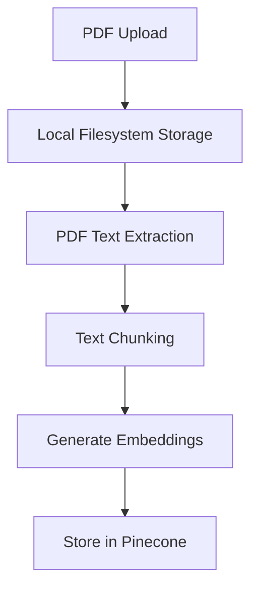
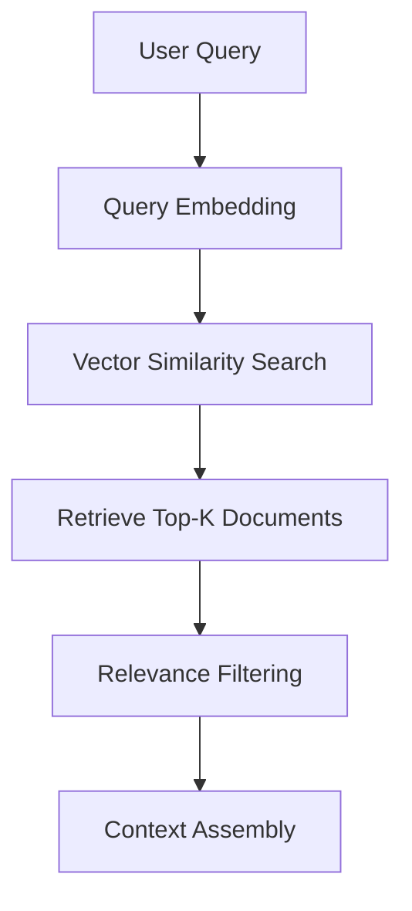
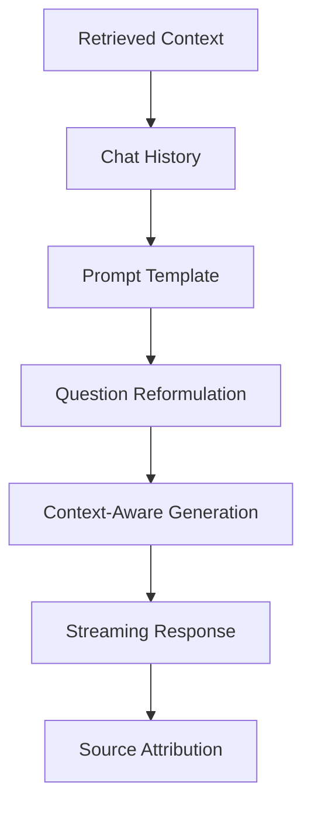

# Chat with PDF


A chat application which focuses on information retrieval by answering questions related to the provided PDF documents. The app utilises LangChain and retrieval-augmented-generation (RAG) to generate responses that are deeply informed by the content within the PDFs as well as the context of the chat history. Supports multiple AI providers including OpenAI, Anthropic, Google, and DeepSeek.

## Tech Stack

- **Frontend & Backend**: Next.js 14, React, TypeScript, Tailwind CSS
- **AI & ML**: LangChain, Vercel AI SDK, OpenAI Embeddings
- **AI Providers**: OpenAI (GPT-5, GPT-4.1), Anthropic (Claude 4 Sonnet), Google (Gemini 2.5), DeepSeek (R1, V3)
- **Database**: SQLite (local), Drizzle ORM
- **Vector Database**: Pinecone
- **File Storage**: Local filesystem
- **Payments**: Stripe

## How the RAG (Retrieval-Augmented Generation) System Works

This application implements a RAG pipeline that combines information retrieval with generative AI to provide accurate, source-based answers about PDF documents.

### 1. Document Ingestion Pipeline



**Process Details:**

- **File Upload**: PDFs are uploaded via an API route and stored on the local filesystem in `./uploads/`
- **Text Extraction**: LangChain's PDFLoader extracts text content while preserving page metadata
- **Document Chunking**: RecursiveCharacterTextSplitter divides documents into 1000-character chunks with 200-character overlap for context preservation
- **Vectorization**: OpenAI's `text-embedding-3-small` model converts text chunks into high-dimensional vectors
- **Storage**: Embeddings are stored in Pinecone vector database with metadata (page numbers, file keys, original text)

### 2. Query Processing & Retrieval



**Process Details:**

- **Query Vectorization**: User questions are converted to embeddings using the same model
- **Similarity Search**: Pinecone performs cosine similarity search to find the most relevant document chunks
- **Relevance Filtering**: Adaptive threshold filtering (0.6-0.65) with fallback to top 2 matches
- **Deduplication**: Similar chunks are deduplicated based on content preview
- **Context Limiting**: Retrieved context is truncated to 5000 characters with page number attribution

### 3. Response Generation



**Process Details:**

- **Question Reformulation**: LangChain creates standalone questions from conversational context
- **Prompt Engineering**: Structured templates ensure the AI stays grounded in retrieved content
- **Multi-Model Generation**: Supports OpenAI, Anthropic, Google, and DeepSeek models for response generation
- **Source Tracking**: Page numbers and original text snippets are preserved for citation
- **Real-time Streaming**: Responses are streamed to provide immediate user feedback

## Getting Started

### Prerequisites

- Node.js 18+
- Pinecone account and API key
- At least one AI provider API key (OpenAI, Anthropic, Google, or DeepSeek)
- OpenAI API key (required for embeddings regardless of chat model choice)

### Installation

1. **Install dependencies**

   ```bash
   npm install
   ```

2. **Configure environment variables**

   Copy `.env.local` and fill in the required values:

   ```env
   # Pinecone (vector DB for embeddings)
   PINECONE_API_KEY=

   # AI Model API Keys (at least one required, OpenAI required for embeddings)
   OPENAI_API_KEY=
   ANTHROPIC_API_KEY=
   GOOGLE_API_KEY=
   DEEPSEEK_API_KEY=

   # App
   NEXT_BASE_URL=http://localhost:3000
   ```

3. **Set up the database**

   ```bash
   npm run db-push
   ```

4. **Start the development server**

   ```bash
   npm run dev
   ```

5. **Open your browser**

   Navigate to `http://localhost:3000`
