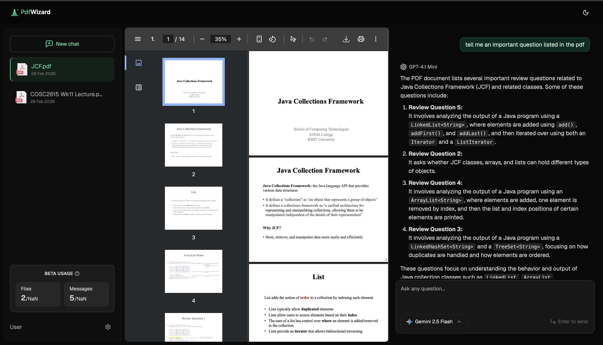

# Chat with PDF

A local chat application for asking questions about PDF documents. Uses LangChain and retrieval-augmented generation (RAG) to generate responses informed by the content of uploaded PDFs. Supports multiple AI providers including OpenAI, Anthropic, Google, and DeepSeek.



## Tech Stack

- **Frontend & Backend**: Next.js 14, React, TypeScript, Tailwind CSS
- **AI & ML**: LangChain, Vercel AI SDK, OpenAI Embeddings
- **AI Providers**: OpenAI (GPT-5, GPT-4.1), Anthropic (Claude 4 Sonnet), Google (Gemini 2.5), DeepSeek (R1, V3)
- **Database**: SQLite (local), Drizzle ORM
- **Vector Database**: Pinecone
- **File Storage**: Local filesystem

## How It Works

The app implements a three-stage RAG pipeline:

1. **Document Ingestion** - PDFs are uploaded, text is extracted and chunked, then embedded using OpenAI's `text-embedding-3-small` model and stored in Pinecone.
2. **Query & Retrieval** - User questions are vectorized and matched against stored embeddings via cosine similarity search with relevance filtering.
3. **Response Generation** - Retrieved context is combined with chat history into a structured prompt, and the selected AI model generates a streamed response with source attribution.

## Getting Started

### Prerequisites

- Node.js 18+
- Pinecone account and API key
- At least one AI provider API key (OpenAI, Anthropic, Google, or DeepSeek)
- OpenAI API key (required for embeddings regardless of chat model choice)

### Setup

1. **Install dependencies**

   ```bash
   npm install
   ```

2. **Configure environment variables**

   Create a `.env.local` file:

   ```env
   # Pinecone (vector DB for embeddings)
   PINECONE_API_KEY=

   # AI Model API Keys (at least one required, OpenAI required for embeddings)
   OPENAI_API_KEY=
   ANTHROPIC_API_KEY=
   GOOGLE_API_KEY=
   DEEPSEEK_API_KEY=

   # App
   NEXT_BASE_URL=http://localhost:3000
   ```

3. **Set up the database**

   ```bash
   npm run db-push
   ```

4. **Start the dev server**

   ```bash
   npm run dev
   ```

5. Open `http://localhost:3000`
